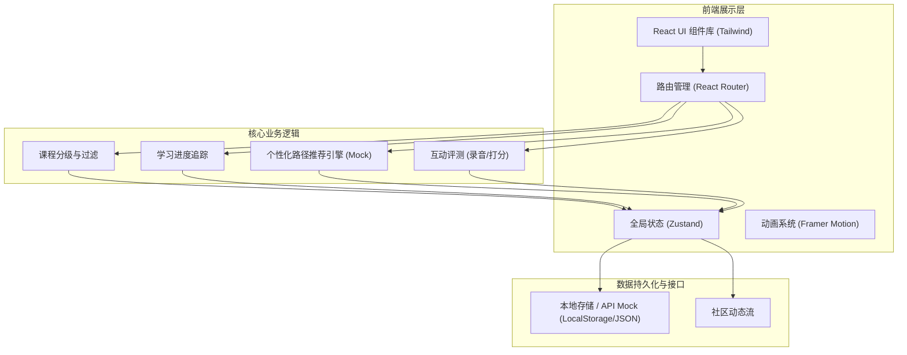
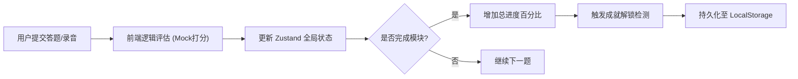

## 1. 架构设计


## 2. 技术描述
- **前端核心**: React@18 + Vite (采用函数式组件和 Hooks 架构)
- **样式系统**: Tailwind CSS v3 (实现高定制化的响应式设计与交互动画)
- **路由管理**: React Router v6 (支持动态课程路径及页面鉴权守卫)
- **状态管理**: Zustand (轻量级，适合处理全局的学习进度和用户鉴权状态)
- **图标与插画**: Lucide React (提供一致性的界面交互图标)
- **动效处理**: Framer Motion (用于单词卡片的 3D 翻转、答题反馈动画和页面切换过渡)
- **数据可视化**: Recharts (用于个人中心学习曲线和雷达图展示)

## 3. 路由定义
| 路由路径 | 用途 |
|-------|---------|
| `/` | 平台首页，包含产品特色、热门语言快速入口 |
| `/login` | 用户注册与登录页面 |
| `/dashboard` | 学习者看板，展示学习进度、推荐路径及成就系统 |
| `/courses` | 分级课程体系，提供多语种和难度筛选功能 |
| `/courses/:courseId` | 课程详情页，展示大纲及互动学习模块入口 |
| `/learn/:moduleId` | 沉浸式互动学习页面（涵盖单词、语法、口语、听力） |
| `/community` | 多语种学习社区，支持图文分享与互动交流 |

## 4. API 定义 (前端 Mock Schema)

```typescript
// 用户模型
interface User {
  id: string;
  name: string;
  avatar: string;
  targetLanguage: string; // 目标语言，如 "ja", "en", "ko"
  level: "A1" | "A2" | "B1" | "B2" | "C1" | "C2";
  learningStreak: number; // 连续打卡天数
}

// 课程模型
interface Course {
  id: string;
  language: string;
  level: string;
  title: string;
  description: string;
  modules: LearningModule[];
  totalProgress: number;
}

// 互动学习模块
interface LearningModule {
  id: string;
  type: "vocabulary" | "grammar" | "speaking" | "listening";
  title: string;
  isCompleted: boolean;
  score?: number;
}

// 社区动态
interface Post {
  id: string;
  authorId: string;
  languageTag: string;
  content: string;
  likes: number;
  comments: number;
  createdAt: string;
}
```

## 5. 数据流转图 (进度追踪模块)


