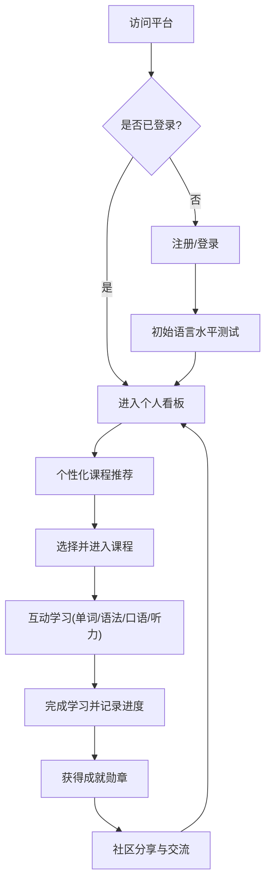

## 1. 产品概述
本产品是一款支持多语种学习（涵盖英语、日语、韩语等主流语言）的在线教育平台。旨在通过分级课程体系、互动式学习模块、进度追踪以及社区激励机制，为用户打造沉浸式、个性化的语言学习体验。

## 2. 核心功能

### 2.1 用户角色
| 角色 | 注册方式 | 核心权限 |
|------|---------------------|------------------|
| 学习者 | 邮箱/社交账号注册 | 浏览课程、参与互动学习、发布社区动态、查看进度 |
| 管理员 | 后台系统分配 | 课程内容管理、用户管理、社区内容审核 |

### 2.2 功能模块
1. **首页**: Hero Section展示平台愿景，热门语言入口，精选推荐课程。
2. **课程体系页**: 支持按语种和难度（A1-C2等分级）筛选的课程列表，课程详情展示。
3. **互动学习页**: 包含单词记忆卡片、语法填空练习、口语录音跟读打分、听力多媒体训练。
4. **个人中心页**: 学习数据仪表盘、进度追踪、个性化学习路径推荐、成就勋章展示。
5. **社区交流页**: 学习心得分享、多语种语言角、点赞评论互动。

### 2.3 页面详情
| 页面名称 | 模块名称 | 功能描述 |
|-----------|-------------|---------------------|
| 首页 | Hero Section | 轮播展示平台特色、快速注册/测试入口 |
| 首页 | 热门课程推荐 | 根据热度推荐主流语种的入门及进阶课程 |
| 课程体系页 | 分级导航 | 侧边栏/顶部栏提供语种及难度级别筛选 |
| 互动学习页 | 听说读写模块 | 提供沉浸式的练习界面，支持录音、答题及即时反馈 |
| 个人中心页 | 数据看板 | 图表化展示每日学习时长、词汇量积累进度 |
| 社区交流页 | 动态信息流 | 按语种划分的交流板块，支持发布图文及语音动态 |

## 3. 核心流程
用户首先进行注册登录，随后可通过初始水平测试获得个性化的学习路径推荐。根据推荐或自主选择进入分级课程，完成互动式学习模块后，系统自动记录进度并发放成就奖励，用户还可将学习成果分享至社区。

## 4. 用户界面设计

### 4.1 设计风格
- **主色调**：采用科技蓝（象征智慧与教育）搭配活力橙（象征互动与成就），营造积极的学习氛围。
- **按钮风格**：大圆角设计，具有微妙的阴影与悬停放大动画，提升点击反馈感。
- **字体与排版**：中英文字体搭配（如 Inter / Noto Sans），注重留白与层级对比，确保长时间阅读的舒适性。
- **布局风格**：采用现代化卡片式布局，结合顶部导航和清晰的侧边功能栏。
- **图标/插画**：使用扁平化且色彩明快的矢量插画，降低学习枯燥感。

### 4.2 页面设计概览
| 页面名称 | 模块名称 | UI 元素设计 |
|-----------|-------------|-------------|
| 首页 | Hero Section | 全屏渐变背景，大标题，醒目的CTA（Call to Action）按钮，带有浮动语言符号动画 |
| 互动学习页 | 学习卡片 | 居中显示的大尺寸互动卡片，带有翻转动画（单词记忆）和音频波形可视化（口语跟读） |
| 个人中心页 | 数据看板 | 环形进度条、热力图（展示学习打卡频率）、3D质感的成就勋章图标 |

### 4.3 响应式设计
采用桌面端优先的响应式设计策略。
- 桌面端：充分利用宽屏展示复杂的仪表盘和多列课程内容。
- 移动端适配：导航栏折叠为汉堡菜单，互动学习模块（尤其是口语和单词记忆）优化为大按钮防误触设计，适合单手操作。
